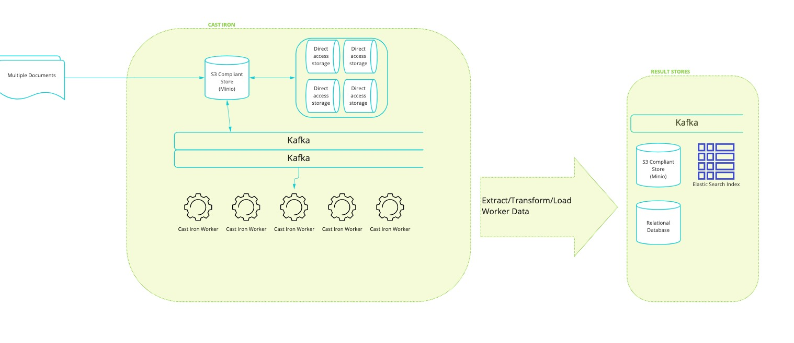

#    CAST-IRON

CAST-IRON (Cloud Agnostic Storage Technology for Intelligent Record-enrichment and Open Navigation) is a novel, open source, generalizable big data platform to perform Extract, Transform, and Load (ETL) operations. 

CAST-IRON is designed to provide:

* ingestion of a variety of data
* deployable in the myriad of usage contexts (e.g. at the edge, on bare metal, in the cloud) 
* plug and play processing definitions that can be user managed from a simple interface
* easy access to containerized services providing novel processing capabilities

CAST-IRON leverages:
* Object Storage ([AWS S3], [MinIO], etc.) for easy notification and data access
* Message Queue ([Kafka], [Nats], etc.) for rapid relay of data to components
* Worker ([Ray], [Faust], etc.) for scalable, distributed data processing
* ETL (Bash Scripts, Python) for rapid and flexible data transformation

This repository contains the docker-compose recipe for staring up the backbone of Cast-Iron as well as the Cast-Iron Worker. 

Main Parts of the system include:
* Object Storage ([AWS S3], [MinIO], etc.)
* Message Queue ([Kafka], [Nats], etc.)
* Worker ([Celery], [Faust], etc.)
* ETL (Bash Scripts, Python)

 

## Getting Started

* Install [Docker]
* Create a startup script within your existing project that you would like to use Cast-Iron with. 
  See `cast-iron-recipe-postgres` for an example of this.   
* Clone this repository as a submodule within your existing repository with 
  `git submodule add git@github.com:black-cape/cast-iron-docker-compose.git`
  

Once started, the following areas are accessible:
* MinIO at localhost:9000
* PostgreSQL
    * User: castiron
    * Password: castiron
    * Host: localhost
    * Port: 5432
    * Database: castiron

## Ingest Some Files

1. Download some data to ingest from `cast-iron-recipe-postgres`

1. Go to http://localhost:9000 and drag+drop a .toml file onto the approapriate directory. This configures how the system will handle files that are uploaded to various buckets and folders.

1. Drag and drop various types of mock data into the appropriate directory in Minio. As each file is ingested, it will be moved between the directories defined by the proocessor and .toml file.  

1. After a file has been ingested, you can navigate to the appropriate location defined in the .toml file or processor and find your data results.

[AWS S3]: https://aws.amazon.com/s3/
[Celery]: https://docs.celeryproject.org/en/stable/index.html
[Docker]: https://www.docker.com/
[Faust]: https://faust.readthedocs.io/en/latest/index.html
[Kafka]: https://kafka.apache.org/
[MinIO]: https://min.io/
[MySQL]: https://www.mysql.com/
[Nats]: https://nats.io/
[PostgreSQL]: https://www.postgresql.org/
[SQLite]: https://www.sqlite.org/index.html
[MS SQL]: https://www.microsoft.com/en-us/sql-server
[Ray]: https://www.ray.io